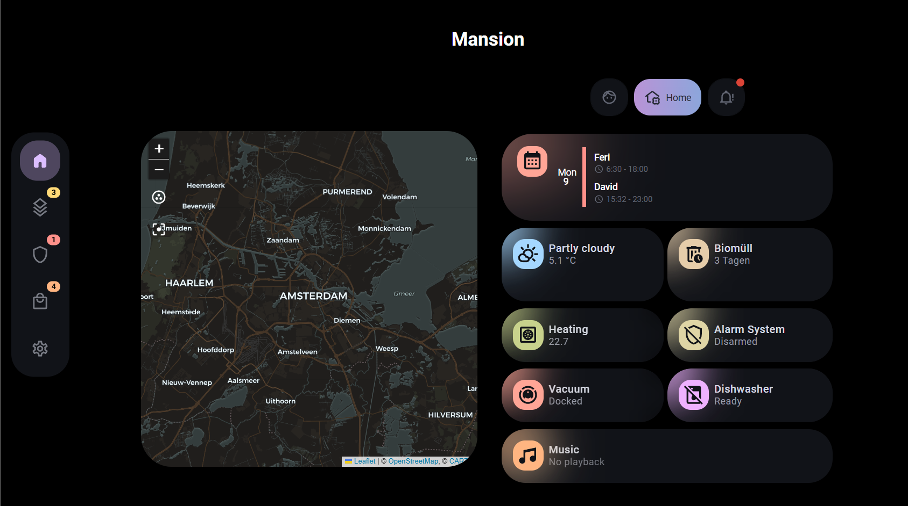
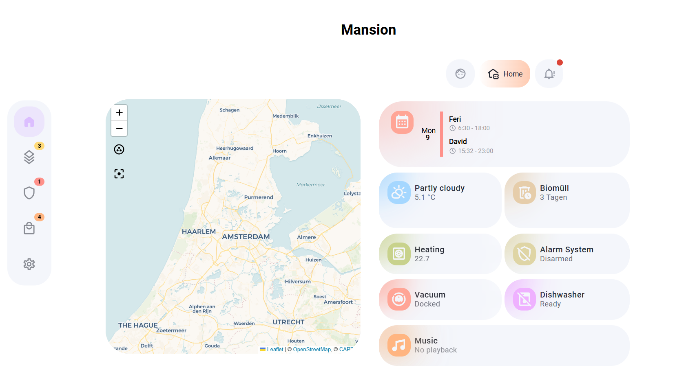
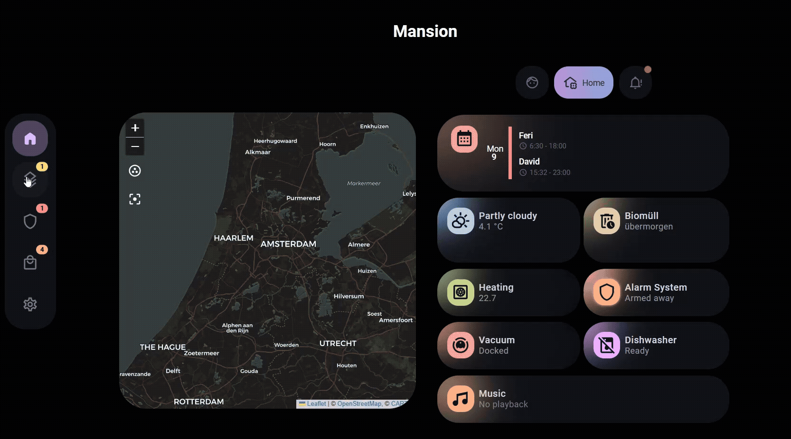
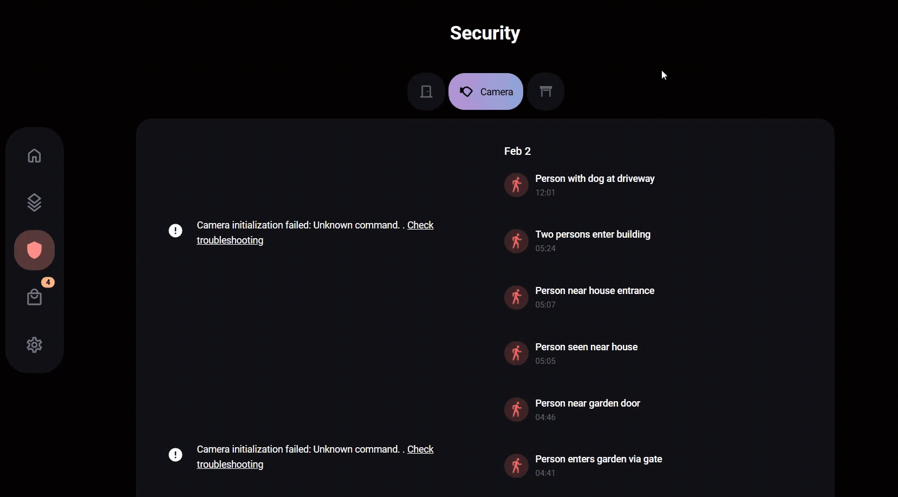
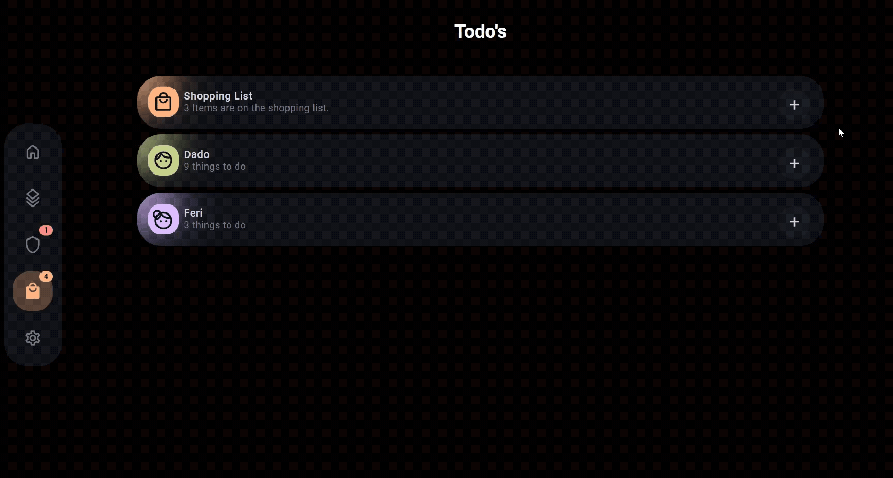
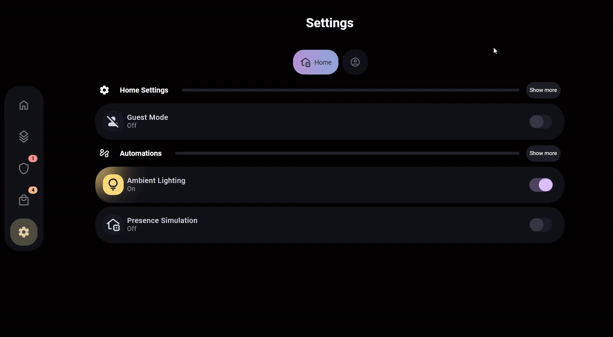
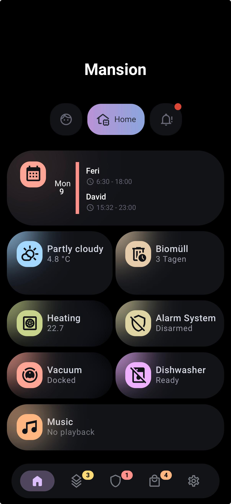
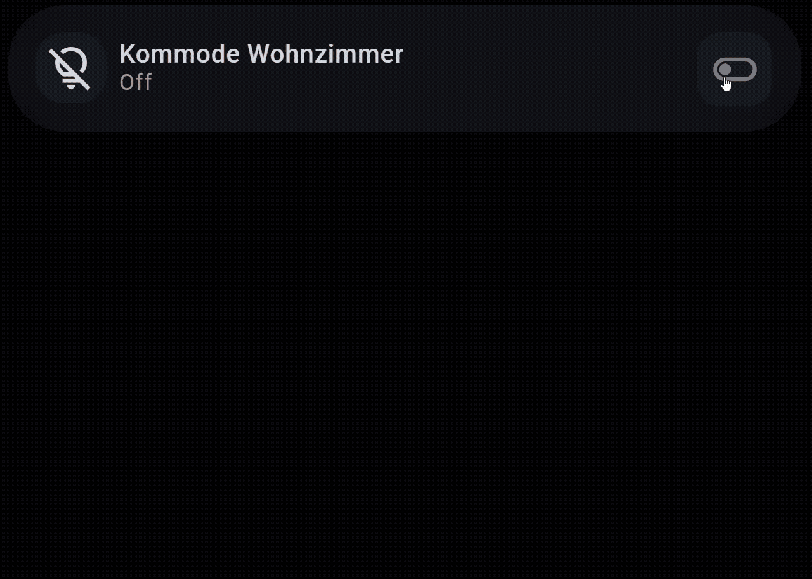
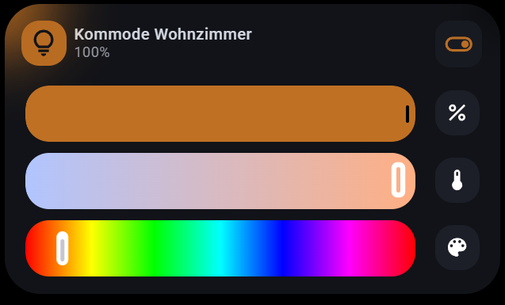
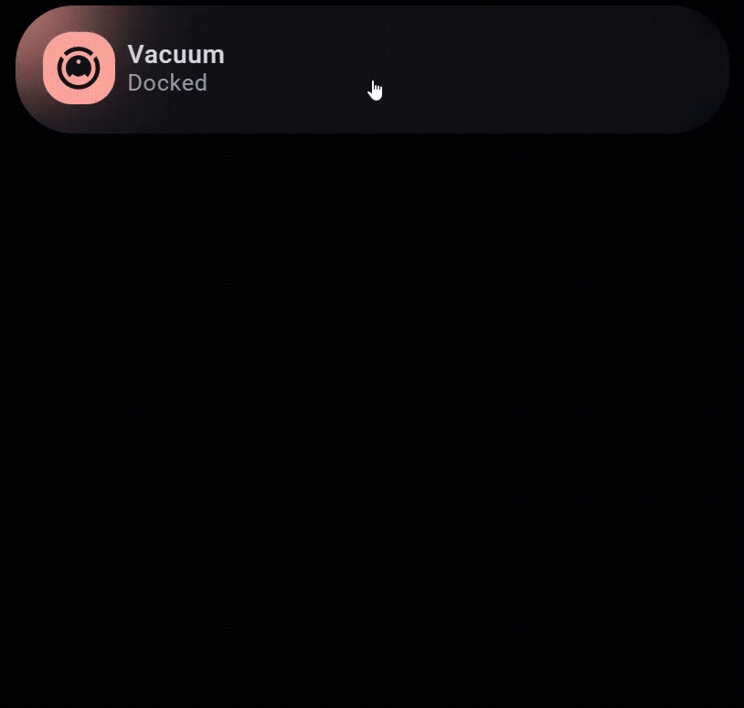

# Dados Dashboard

A modern, clean Home Assistant dashboard built with custom button cards and expander card  for a consistent UI experience.


## Screenshots

<a href="images/home.gif">
  
</a>

### Home Dark/Light Mode
<a href="images/home-dark.png">
  
</a>

<a href="images/home-light.png">
  
</a>

#### Dark Mode – Views

<p align="left">
  <a href="images/floors.gif">
    
  </a>
  <a href="images/security.gif">
    
  </a>
  <a href="images/todos.gif">
    
  </a>
  <a href="images/settings.gif">
    
  </a>


</p>

### Mobile
<details>
  <summary><b>Mobile (Dark Mode)</b></summary>

  <a href="images/mobile-dark.jpeg">
    
  </a>
</details>


## Features

- 🏠 **Multi-floor overview** - Navigate through different floors and rooms with simple-tabs
- 💡 **Lighting control** - Full control over all lights with auto entities
- 🌡️ **Climate & Heating** - Vaillant heat pump integration via myPyllant
- 🪟 **Shutters & Blinds** - Control all roller shutters with custom sliders
- 🤖 **Vacuum robot** - With Roborock Integration
- 📷 **Security cameras** - Reolink cameras with Frigate integration
- 🎵 **Music** - Music Assistant with Mediocore player
- 🗑️ **Waste collection** - Schedule and reminders with Waste Collection Schedule 
- 📅 **Calendar** - Integrated calendar card with Calendar Card Pro
- 🍽️ **Dishwasher** - Home Connect Local integration
- 🚨 **Alarm system** - Alarmo integration
- 🌤️ **Weather** - Current conditions and forecastt with OpenWeatherMap

## Card Architecture

This dashboard uses a modular approach with:

- **[Button Card](https://github.com/custom-cards/button-card)** - Custom styled buttons with templates
- **[Expander Card](https://github.com/Alia5/lovelace-expander-card)** - Collapsible sections for cleaner UI
- **[Decluttering Card](https://github.com/custom-cards/decluttering-card)** - Reusable templates to reduce code duplication
- **[Bubble Card](https://github.com/Clooos/Bubble-Card)** - Beautiful popups and sub-buttons

## Installation

### Prerequisites

- [HACS](https://hacs.xyz/) installed

### Step 0: Informations

This Dashboard is inspired by: 
- **[LE0N](https://community.home-assistant.io/t/rounded-dashboard-guide/543043)**
- **[HA Dashboards](https://www.youtube.com/@HADashboards)** - And his Discord Members
- **[My Smart Home](https://www.youtube.com/@My_Smart_Home)**
- **[ElementZoom](https://github.com/ElementZoom)**

I apologize if I've forgotten anyone


### Step 1: Install HACS Integrations

> [!NOTE]  
> If you dont need the Integration (for example myPyllant) do not install it!

<details>
  <summary><b>Backend (Integrations)</b></summary>

   Install the following **Integrations** via HACS :

   | Integration | Description |
   |-------------|-------------|
   | [Alarmo](https://github.com/nielsfaber/alarmo) | Alarm system |
   | [Bermuda BLE Trilateration](https://github.com/agittins/bermuda) | Bluetooth/BLE room presence & device tracking |
   | [Browser Mod](https://github.com/thomasloven/hass-browser_mod) | Browser control & popups |
   | [Bubble Card Tools](https://github.com/Clooos/Bubble-Card-Tools) | Backend for Bubble Card modules / module store |
   | [C.A.F.E.](https://github.com/FezVrasta/cafe-hass) | Visual automation flows (YAML-native) |
   | [Creality Websocket Integration](https://github.com/3dg1luk43/ha_creality_ws) | Local Creality K-series telemetry/control via WebSocket |
   | [Custom Icons](https://github.com/thomasloven/hass-custom_icons) | Use additional Iconify icon sets in HA |
   | [Frigate](https://github.com/blakeblackshear/frigate-hass-integration) | NVR integration |
   | [Home Connect Local](https://github.com/ekutner/home-connect-hass) | Home Connect appliances (local) |
   | [LLM Vision](https://github.com/valentinfrlch/ha-llmvision) | Visual intelligence (image/video/camera feed analysis) |
   | [Lunar Phase](https://github.com/ngocjohn/lunar-phase) | Moon phase / astronomy sensors |
   | [Music Assistant](https://github.com/music-assistant/hass-music-assistant) | Music player |
   | [Music Assistant Jukebox](https://github.com/DJS91/HAMusicAssistantJukebox) | Guest-friendly jukebox for Music Assistant |
   | [myPyllant](https://github.com/signalkraft/mypyllant-component) | Vaillant heat pump |
   | [Presence Simulation](https://github.com/slashback100/presence_simulation) | Simulate presence |
   | [Reolink](https://github.com/fwestenberg/reolink_dev) | Reolink cameras |
   | [Reolink thumbs](https://github.com/cyr-ius/hass-reolink-thumbs) | Reolink thumbnails in Media Source |
   | [Roborock Custom Map](https://github.com/Lash-L/RoborockCustomMap) | Map support for Roborock (pairs with Vacuum Map Card) |
   | [Unraid API](https://github.com/domalab/ha-unraid) | Unraid monitoring via local GraphQL API |
   | [View Assist](https://github.com/dinki/View-Assist) | Visual feedback UI + automations for Assist |
   | [View Assist Companion App](https://github.com/msp1974/ViewAssist_Companion_App) | Android companion app + HA integration for View Assist |
   | [Virtual Components](https://github.com/twrecked/hass-virtual) | Virtual helper components for testing/dev |
   | [Waste Collection Schedule](https://github.com/mampfes/hacs_waste_collection_schedule) | Waste calendar |
   | [WebRTC Camera](https://github.com/AlexxIT/WebRTC) | Real-time camera viewing via WebRTC/go2rtc |
   | [Xiaomi Cloud Map Extractor](https://github.com/PiotrMachworker/Home-Assistant-custom-components-Xiaomi-Cloud-Map-Extractor) | Vacuum maps |

</details>


<details>
  <summary><b>Frontend (Dashboard Cards / Resources)</b></summary>

   Install the following **Frontend** repositories via HACS (alphabetically sorted):

   | Card / Resource | Description |
   |-----------------|-------------|
   | [Auto-Entities](https://github.com/thomasloven/lovelace-auto-entities) | Automatically populate entity lists |
   | [BHA Icon Pack](https://github.com/hulkhaugen/hass-bha-icons) | Additional icon set |
   | [Button Card](https://github.com/custom-cards/button-card) | Highly customizable button card |
   | [Calendar Card Pro](https://github.com/flixlix/calendar-card-pro) | Highly customizable calendar card |
   | [Decluttering Card](https://github.com/custom-cards/decluttering-card) | Reusable decluttering templates |
   | [Expander Card](https://github.com/Alia5/expander-card) | Expand/collapse card sections |
   | [Firemote Card](https://github.com/PRProd/HA-Firemote) | Remote control UI (Fire TV / Android TV etc.) |
   | [Large Number Input Card](https://github.com/junkfix/numberbox-card) | Large numeric input control (+ / - buttons) |
   | [Layout Card](https://github.com/thomasloven/lovelace-layout-card) | Layout/grid control for Lovelace |
   | [LLM Vision Card](https://github.com/valentinfrlch/llmvision-card) | Timeline card for LLM Vision |
   | [Material Symbols](https://github.com/beecho01/material-symbols) | Google Material Symbols icon set |
   | [Mediocre Hass Media Player Cards](https://github.com/antontanderup/mediocre-hass-media-player-cards) | Advanced media player cards |
   | [Mini Graph Card](https://github.com/kalkih/mini-graph-card) | Minimalistic graphs |
   | [Mushroom](https://github.com/piitaya/lovelace-mushroom) | Mushroom card collection |
   | [My Cards Bundle](https://github.com/AnthonMS/my-cards) | Bundle: my-slider, my-slider-v2, my-button, … |
   | [Navbar Card](https://github.com/joseluis9595/lovelace-navbar-card) | Responsive bottom/side navigation bar |
   | [Paper Buttons Row](https://github.com/jcwillox/lovelace-paper-buttons-row) | Configurable button row |
   | [PrintWatch Card](https://github.com/drkpxl/printwatch-card) | Bambu Lab printer monitoring/control card |
   | [Simple Tabs Card](https://github.com/agoberg85/home-assistant-simple-tabs) | Simple tabs for dashboards |
   | [Stack In Card](https://github.com/custom-cards/stack-in-card) | Group multiple cards into one (no borders) |
   | [Time Picker Card](https://github.com/GeorgeSG/lovelace-time-picker-card) | Time selector for `input_datetime` |
   | [Timer Bar Card](https://github.com/rianadon/timer-bar-card) | Progress bar for timers |
   | [Vertical Stack In Card](https://github.com/ofekashery/vertical-stack-in-card) | Group multiple cards into one sleek card |
   | [Weather Card Extended](https://github.com/Thyraz/weather-forecast-extended) | Extended weather forecast card |
   | [Xiaomi Vacuum Map Card](https://github.com/PiotrMachowski/lovelace-xiaomi-vacuum-map-card) | Map-based vacuum control card |

   ---
</details>

> [!IMPORTANT]
> Some repos might show up in HACS under **Frontend** or **Dashboard** (depends on the repository metadata). If you don’t find one in the default list, add it via **HACS → Custom repositories**.

### Step 3: Copy Dashboard Files

1. Clone or download this repository:
   ```bash
   git clone https://github.com/agrestisdavid/dados-dashboard.git
   ```

2. Copy/Create the following folders/files to your Home Assistant `/config` directory:
   ```
   dashboards/ha-dados-dashboard
   themes/
   ```

3. Add the dashboard to your `configuration.yaml`:
   ```yaml
   lovelace:
     mode: storage
     dashboards:
       dados-dashboard:
         mode: yaml
         title: Dados Dashboard
         icon: mdi:view-dashboard
         show_in_sidebar: true
         filename: dashboards/ha-dados-dashboard/ha-dados-dashboard.yaml
   ```

4. Add themes to your `configuration.yaml`:
   ```yaml
   frontend:
     themes: !include_dir_merge_named themes
   ```

5. Check your Configuration and restart Home Assistant

### Directory Structure

```
config/
├── dashboards/
│   └── ha-dados-dashboard/
│       ├── ha-dados-dashboard.yaml
│       └── views/
│           ├── home.yaml
│           ├── heating.yaml
│           ├── security.yaml
│           ├── music.yaml
│           ├── floors.yaml
│           ├── homelab.yaml
│           ├── settings.yaml
│           ├── todo.yaml
│           └── raw/
│                 ├── decluttering_card_templates/
│                 ├── button_card_templates/
│                 ├── bubble_card_popups/
│                 ├── kiosk/
│                 └── navbar/
├── themes/
│   └── rounded/
│       └── dados-theme.yaml
│
└── configuration.yaml

```


## How to use

### Example Light

<a href="images/light.gif">
  
</a>

<br/>

<a href="images/light-expanded.png">
  
</a>

#### Code
```yaml

type: custom:decluttering-card
template: dados_light_expander
variables:
   entity: light.your_light

```
> [!NOTE]
> If your light has only toggle (on/off) use button-card with template: dados_light
 ```yaml
type: custom:button-card
template: dados_light
variables:
   entity: light.your_light

 ```

#### Light Card Structure
```
decluttering-template: dados_light_expander
└── expander-card
    ├── title-card
    │   ├── custom:button-card
    │   ├── template: 
    │   └── dados_light
    └── child-card
        └── custom:auto-entities 
            ├── custom:button-card 
            └── template: 
                ├── dados_light_brightness
                ├── dados_light_temp
                └── dados_light_hue


```

#### Template:


<details>
  <summary><b>Show YAML: dados_light_expander</b></summary>

  <div>

```yaml
dados_light_expander:
   card:
   type: custom:expander-card
   title-card-clickable: true
   title-card-button-overlay: true
   clear-children: true
   child-padding: 0px 5px
   child-margin-top: -15px
   clear: false
   padding: 0px
   icon: m3o:info
   animation: true
   arrow-color: var(--contrast16)
   gap: 0px
   expanded: false
   overlay-margin: 17px 70px 0px 0px
   button-background: var(--contrast3)
   icon-rotate-degree: 0deg
   templates: []
   expanded-gap: 0px
   expander-card-id: "[[entity]]"
   show-button-users:
      - vaca-kuche  # create a user and show only him the button so you have a clean ui

   title-card:
      type: custom:button-card
      template: dados_light
      variables:
         entity: "[[entity]]"
         card_color: transparent
      styles:
         card:
         - overflow: visible

   cards:
      - type: custom:auto-entities
         card:
         type: entities
         filter:
         include:
            - entity_id: "[[entity]]"
               label: dimm
               options:
               type: custom:button-card
               template: dados_light_brightness
               variables:
                  entity: "[[entity]]"
            - entity_id: "[[entity]]"
               label: temp
               options:
               type: custom:button-card
               template: dados_light_temp
               variables:
                  entity: "[[entity]]"
            - entity_id: "[[entity]]"
               label: hue
               options:
               type: custom:button-card
               template: dados_light_hue
               variables:
                  entity: "[[entity]]"
         exclude: []
   style: |2

         .header-overlay {
         height: unset !important;
         }
         button.header {
         border-radius: 16px !important;
         overflow: hidden !important;
         }
   card_mod:
      style:
         .: |
         ha-card {
            border-radius: 36px !important;
            overflow: hidden !important;
         }
   ```
   </div>
</details>


### Vacuum Card Example

<a href="images/vacuum.gif">

</a>


#### Code
```yaml
type: custom:decluttering-card
template: dados_vacuum_roboter_card:
variables:
   - entity: vacuum.your_vacuum
   - title:
      type: custom:button-card
      template:
         - dados_vacuum_roboter
      styles:
         card:
         - overflow: visible   
   - cards:
      - type: custom:decluttering-card
         template: dados_vacuum_roboter_control


```
> [!IMPORTANT] 
> You need to change entities inside dados_vacuum_roboter_control to make this work.


#### Vacuum Card Structure
``` 
decluttering-template: dados_vacuum_roboter_card
└── expander-card
    ├── title-card
    │   └── custom:button-card
    │       ├── template: 
    │       └── dados_vacuun_roboter
    └── child-card
        └── custom:decluttering-card
            ├── template: 
            └── dados_vacuum_roboter_control

```


#### Theme

The custom theme is located at `themes/rounded/dados-theme.yaml`. Adjust colors and styles there.

#### UI + Templates

> [!NOTE] 
> If you want to use UI, you need to copy the templates to your RAW-Config.


## Contributing

Feel free to open issues or submit pull requests for improvements.

## License

MIT License - feel free to use and modify for your own setup.

## Credits

- Inspired by various Home Assistant community dashboards

